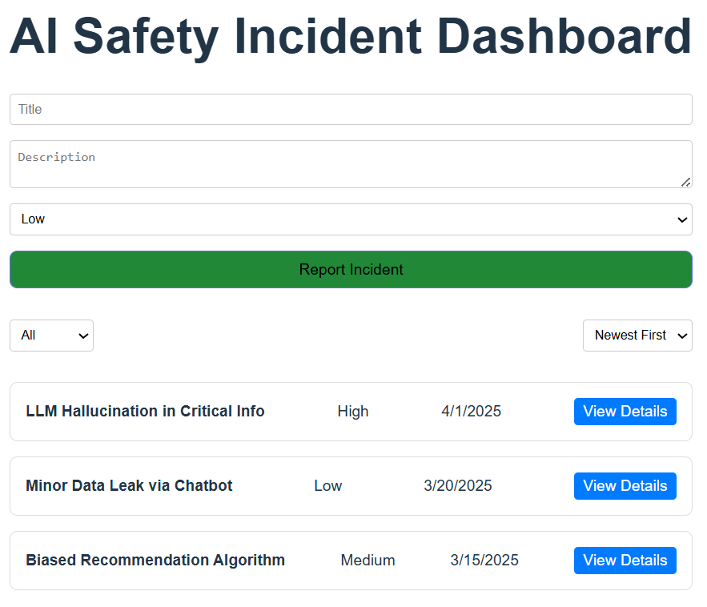

# AI-Safety-Incident-Dashboard
A frontend assignment for an AI safety startup designed to demonstrate core frontend development skills using **React**, **TypeScript**, and **CSS Modules**.


# 🛠️ Tech Stack
- **Language:** TypeScript
- **Framework:** React
- **Styling:** CSS Modules
- **Layout:** Flexbox/Grid (Responsive Design)
  
## 🚀 Features

- Display a list of mock AI safety incidents (Title, Severity, Date)
- Filtering by severity (All, Low, Medium, High)
- Sorting by reported date (Newest First, Oldest First)
- Toggle to view full incident descriptions
- Add new incidents using a form
- Input validation for required fields
- Fully responsive UI for mobile and desktop
## 📦 Getting Started

### 1. Clone the Repository

```bash
git clone https://github.com/Nagoluaadhi/AI-Safety-Incident-Dashboard.git
cd ai-safety-incident-dashboard
```
### 2. Install Dependencies
```bash
npm install
```
### 3. Run the Application
```bash
npm run dev
```
The app will run at: http://localhost:3000
## 🧠 Design Decisions
**State Management**: Used React useState for managing incident data locally.

**Styling**: Chose CSS Modules for encapsulated styles, avoiding global conflicts.

**Responsiveness**: Used Tailwind-inspired utility-first principles with Flexbox/Grid for mobile responsiveness.

**User Experience**: Focused on clean, accessible layout and simple form validation.
## 📁 Folder Structure
```bash
src/
├── components/
│   ├── IncidentForm.tsx
│   ├── IncidentItem.tsx
│   └── IncidentList.tsx
├── data/
│   └── mockIncidents.ts
├── App.tsx
└── main.tsx
```
## 📸 Screenshot

